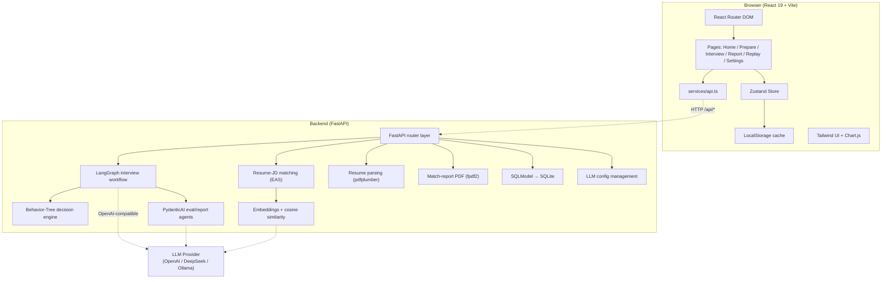

<div align="center">

# ExpSupInterviewer

### Explainable Super Interviewer · Making AI Interview Decisions Fully Transparent

English · [简体中文](./README.md)

</div>

---

> Traditional AI interview products "look smart but feel stiff" — they only hand you a final result without explaining the interview process. When you fail, you still don't know what went wrong.
>
> **ExpSupInterviewer** makes the entire interview decision process transparent through Multi-Agent collaboration, behavior-tree-driven smart follow-ups, PydanticAI structured evaluation, and EAS deep semantic matching — helping job seekers truly understand "why this question was asked" and improve in a targeted way.

## ✨ Key Highlights

- 🧠 **Behavior-Tree-Driven Follow-ups** — Every "should I follow up?" decision is made explicitly by behavior-tree nodes. The decision path is traceable and replayable.
- 🤖 **Multi-Agent Collaboration** — LangGraph orchestrates a multi-agent workflow for follow-up decisions, scoring, and report generation.
- 📊 **PydanticAI Structured Evaluation** — Pydantic models constrain LLM output, keeping scoring dimensions stable, validatable, and hallucination-resistant.
- 🔍 **EAS Deep Semantic Matching** — Real resume–JD fit computed via vector cosine similarity, not keyword stuffing.
- 🎞️ **Decision Replay** — Full interview timeline + per-follow-up decision rationale, so you can review "why it was asked that way".
- 💾 **Interview Persistence** — Interview progress auto-saved to SQLite, with resume-from-break and history replay support.
- ⚙️ **Configurable Question Count** — Freely set 1-20 interview questions to customize interview length.
- 🌗 **Bilingual + Light/Dark Theme** — Built-in i18n (简中 / English) and light/dark theme switching.

## 🎯 Who Is It For

Fresh graduates, career switchers, active job seekers — anyone who wants to level up their interview performance through high-quality mock interviews.

## 🧩 Feature Modules

| Page | Features |
|------|----------|
| **Home** | Value proposition, five highlights, usage flow, comparison advantages |
| **Prepare** | Resume upload (PDF / DOCX / TXT / MD) & parsing, JD input, configurable question count (1-20), resume–JD match report, PDF export |
| **Interview** | Real-time dialogue with typewriter effect, auto-collapse long messages, behavior-tree smart follow-ups, "thinking process" & "why asked" display, live dimension scoring, interview resume |
| **Report** | Multi-dimension radar chart, STAR-dimension scoring, progress curve, actionable suggestions |
| **Replay** | Interview history list, full-process timeline, behavior-tree decision path replay, view report for completed interviews |
| **Settings** | Multi-provider LLM config (OpenAI / DeepSeek / Ollama and any OpenAI-compatible API) |

## 🏗️ Tech Stack

### Frontend

| Tech | Version | Purpose |
|------|---------|---------|
| React | 19 | Component-based UI framework |
| TypeScript | 6 | Type safety |
| Vite | 8 | Build & dev server |
| Tailwind CSS | 4 | Atomic styling |
| React Router DOM | 7 | SPA routing |
| Zustand | 5 | Lightweight state management |
| Chart.js + react-chartjs-2 | - | Radar / ring / bar charts |
| lucide-react | - | Icon library |
| pdfjs-dist | - | Frontend PDF preview |
| oxlint | - | Linting |

### Backend

| Tech | Purpose |
|------|---------|
| FastAPI + Uvicorn | Async web framework & ASGI server |
| LangGraph | Multi-Agent interview workflow orchestration |
| PydanticAI | Structured LLM evaluation (with type validation & retries) |
| SQLModel + aiosqlite | Async ORM & SQLite persistence |
| OpenAI SDK | LLM & Embedding calls (compatible with DeepSeek / Ollama, etc.) |
| Custom Behavior-Tree Engine | Follow-up decisions & decision-path logging |
| EAS module (numpy) | Vector cosine-similarity semantic matching |
| pdfplumber / PyPDF2 / python-docx / fpdf2 | Resume parsing (PDF / DOCX / TXT / MD) & match-report PDF generation |

## 🏛️ Architecture Overview



## 📁 Project Structure

```
ExpSupInterviewer/
├── src/                        # Frontend source
│   ├── pages/                  # Home / Prepare / Interview / Report / Replay / Settings
│   ├── components/
│   │   ├── charts/             # RadarChart / RingChart / ProgressChart
│   │   ├── ui/                 # Button / Card / Input / Badge
│   │   └── ...                 # ChatBubble / DecisionTree / MatchReport / Timeline, etc.
│   ├── hooks/                  # useTypewriter and other custom hooks
│   ├── store/                  # appStore / interviewStore / reportStore (Zustand)
│   ├── services/               # api.ts
│   ├── i18n/                   # zh / en translations
│   ├── theme/                  # light/dark theme
│   └── types/                  # TypeScript type definitions
├── backend/                    # Backend source
│   ├── interview/              # graph.py (LangGraph) / decision_tree / question_bank
│   ├── behavior_tree/          # engine: tree / nodes / blackboard
│   ├── llm/                    # pydantic_agents.py / client.py
│   ├── eas/                    # similarity.py / embedder.py (OpenAI API-based)
│   ├── match/                  # matcher.py resume-JD matching
│   ├── resume/                 # parser.py (PDF / DOCX / TXT / MD)
│   ├── repositories/           # crud.py / llm_config.py
│   ├── main.py                 # FastAPI entry
│   ├── config.py               # config (pydantic-settings)
│   ├── schemas.py              # Pydantic data models
│   └── pdf_generator.py        # match-report PDF generation
├── test/                       # Sample resumes and job descriptions
├── docs/documents/             # PRD / Technical Architecture docs
├── start.bat                   # Windows one-click startup script
├── start.ps1                   # PowerShell startup script
├── requirements.txt / pyproject.toml
└── package.json / vite.config.ts
```

## 🚀 Quick Start

### Prerequisites

- **Node.js** ≥ 20 (22+ recommended)
- **Python** ≥ 3.10
- An OpenAI-compatible LLM service (OpenAI / DeepSeek / local Ollama all work)

### 1. Clone the repository

```bash
git clone https://github.com/<your-org>/ExpSupInterviewer.git
cd ExpSupInterviewer
```

### 2. Configure LLM

Copy the config template and fill in your API key:

```bash
cp backend/config.example.yaml backend/config.yaml
```

Edit `backend/config.yaml` — **only `api_key` and `model` are required**:

```yaml
llm:
  api_key: sk-your-api-key-here     # Required: your API key
  base_url: ""                       # Leave empty for OpenAI; DeepSeek: https://api.deepseek.com/v1
  model: gpt-4o-mini                 # Recommended: gpt-4o-mini / deepseek-v4-flash / qwen-plus

embedding:
  model: text-embedding-3-small      # Embedding model, shares LLM's api_key
```

> Supports all OpenAI-compatible endpoints: OpenAI / DeepSeek / Qwen / Ollama, etc.

### 3. One-click startup (Windows)

```bash
start.bat
```

Or use PowerShell:

```powershell
.\start.ps1
```

The script automatically creates a virtual environment, installs dependencies, and starts both frontend and backend.

### 4. Manual startup

<details>
<summary>Click to expand manual startup steps</summary>

**Start the backend:**

```bash
python -m venv .venv
# Windows: .venv\Scripts\activate   | macOS/Linux: source .venv/bin/activate
pip install -r requirements.txt

# Start FastAPI (listens on 127.0.0.1:9400 by default)
python -m uvicorn backend.main:app --reload --port 9400
```

Health check: visit `http://127.0.0.1:9400/health` — should return `{"status":"ok"}`.

**Start the frontend:**

```bash
npm install
npm run dev
```

Open `http://localhost:5173` in your browser. The frontend proxies `/api/*` to the backend at `127.0.0.1:9400` by default.

</details>

### 5. Production build

```bash
npm run build      # outputs to dist/
npm run preview    # preview the build locally
```

## ⚙️ Configuration Notes

- **LLM config**: Edit `backend/config.yaml` — only `api_key` and `model` required. You can also dynamically add multiple OpenAI-compatible configs in the Settings page.
- **Embedding model**: Based on OpenAI API, shares LLM's `api_key` and `base_url`; just specify `embedding.model` (default: `text-embedding-3-small`). No local model download needed — project size reduced by ~3GB.
- **Database**: SQLite by default, no additional setup needed. Interview progress is auto-persisted with resume-from-break support.
- **Frontend proxy**: See [vite.config.ts](./vite.config.ts) — `/api` is proxied to `http://127.0.0.1:9400`.

## 🔌 API Overview

| Method | Path | Description |
|--------|------|-------------|
| GET | `/health` | Health check |
| POST | `/api/resume/parse` | Parse a resume (PDF / DOCX / TXT / MD file or text) |
| POST | `/api/match` | Resume–JD semantic matching |
| POST | `/api/match/pdf` | Generate match-report PDF |
| POST | `/api/interview/start` | Start an interview session (configurable question count) |
| POST | `/api/interview/answer` | Submit an answer (returns follow-up decision, scores, decision path) |
| GET | `/api/interviews` | List interview history |
| GET | `/api/interview/{id}` | Get session details |
| GET | `/api/interview/{id}/report` | Generate / fetch evaluation report |
| GET | `/api/interview/{id}/decisions` | Get decision-path replay data |
| GET/POST/PUT/DELETE | `/api/settings/llm` | LLM config CRUD |
| POST | `/api/settings/llm/{id}/activate` | Activate an LLM config |

## 🗺️ Roadmap

- [x] **Phase 1**: Frontend-only + mock data to validate core interaction & visualization
- [x] **Phase 2**: Integrate FastAPI + LangGraph for real resume parsing & multi-agent collaboration
- [x] **Phase 3**: Introduce PydanticAI structured evaluation & custom behavior-tree engine
- [x] **Phase 4**: Introduce EAS semantic matching for real resume–JD match reports
- [x] **Phase 5**: Interview persistence & resume, configurable question count, chat optimization, multi-format resume support
- [ ] **Phase 6**: Expanded question bank, performance & observability, more evaluation dimensions

## 🤝 Contributing

Issues and Pull Requests are welcome. Before opening a PR, please ensure:

1. `npm run lint` and backend `ruff` / `mypy` checks pass
2. New features come with necessary documentation
3. Commit messages clearly describe the purpose of the change

## 📄 License

This project is licensed under the [Apache License 2.0](./LICENSE).

## 📚 Related Docs

- [Product Requirements Document (PRD)](./docs/documents/PRD.md) (Chinese)
- [Technical Architecture](./docs/documents/TechnicalArchitecture.md) (Chinese)

---

<div align="center">

If this project helps you, a ⭐ Star is always appreciated!

</div>
