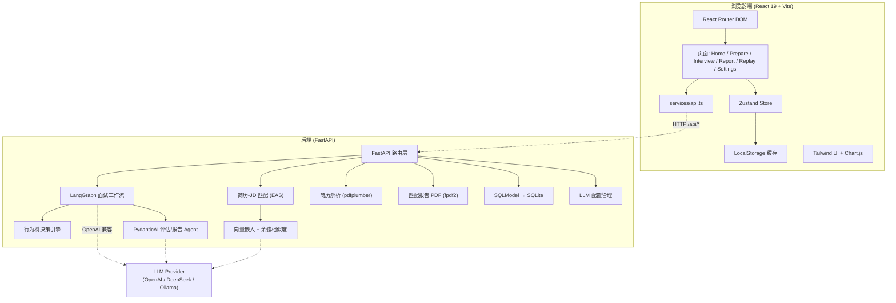

<div align="center">

# ExpSupInterviewer

### 可解释的超级面试官 · 让 AI 面试决策过程完全透明

[English](./README.en.md) · 简体中文

</div>

---

> 传统 AI 面试产品"看起来智能，用起来生硬"——只给最终结果，不解释面试过程。用户失败后依然不知道自己哪里出了问题。
>
> **ExpSupInterviewer** 通过 Multi-Agent 协作、行为树驱动的智能追问、PydanticAI 结构化评估和 EAS 深度语义匹配，让面试决策过程完全透明，帮助求职者真正理解"为什么被问"，实现有针对性的能力提升。

## ✨ 核心亮点

- 🧠 **行为树驱动的智能追问** —— 每一次"是否追问"都由行为树节点显式决策，决策路径可追溯、可回放。
- 🤖 **Multi-Agent 协作** —— 基于 LangGraph 编排"追问决策 / 评分 / 报告生成"等多 Agent 工作流。
- 📊 **PydanticAI 结构化评估** —— 用 Pydantic 模型约束 LLM 输出，评分维度稳定、可校验、拒绝幻觉。
- 🔍 **EAS 深度语义匹配** —— 基于向量余弦相似度计算简历与 JD 的真实匹配度，而非关键词堆叠。
- 🎞️ **决策回放** —— 面试全过程时间线 + 每轮追问的决策理由回溯，复盘"为什么这样问"。
- 💾 **面试持久化** —— 面试进度自动保存至 SQLite，支持中断恢复和历史记录回放。
- ⚙️ **可配置问题数** —— 自由设置 1-20 道面试题，按需定制面试长度。
- 🌗 **中英双语 + 深浅主题** —— 内置 i18n（简中 / English）与明暗主题切换。

## 🎯 适用人群

应届毕业生、职场转型者、持续求职者——任何希望通过高质量模拟面试提升面试表现的人。

## 🧩 功能模块

| 页面 | 功能 |
|------|------|
| **首页** | 产品价值展示、五大亮点、使用流程引导、对比优势 |
| **面试准备页** | 简历上传（PDF / DOCX / TXT / MD）与解析、JD 输入、问题数量配置（1-20）、简历-JD 匹配度报告、报告 PDF 导出 |
| **面试进行页** | 实时对话、打字机效果、长消息自动折叠、行为树智能追问、思考过程与"为什么这样问"展示、实时维度评分、面试中断恢复 |
| **评估报告页** | 多维雷达图、STAR 维度评分、进步曲线、可操作改进建议 |
| **决策回放页** | 面试历史列表、全过程时间线、行为树决策路径回放、已完成面试可直接查看报告 |
| **设置页** | 多 LLM 提供商配置（OpenAI / DeepSeek / Ollama 等 OpenAI 兼容接口） |

## 🏗️ 技术栈

### 前端

| 技术 | 版本 | 用途 |
|------|------|------|
| React | 19 | 组件化 UI 框架 |
| TypeScript | 6 | 类型安全 |
| Vite | 8 | 构建与开发服务器 |
| Tailwind CSS | 4 | 原子化样式 |
| React Router DOM | 7 | 单页应用路由 |
| Zustand | 5 | 轻量状态管理 |
| Chart.js + react-chartjs-2 | - | 雷达图 / 环形图 / 柱状图 |
| lucide-react | - | 图标库 |
| pdfjs-dist | - | 前端 PDF 预览 |
| oxlint | - | Linting |

### 后端

| 技术 | 用途 |
|------|------|
| FastAPI + Uvicorn | 异步 Web 框架与 ASGI 服务器 |
| LangGraph | Multi-Agent 面试工作流编排 |
| PydanticAI | 结构化 LLM 评估（带类型校验与重试） |
| SQLModel + aiosqlite | 异步 ORM 与 SQLite 持久化 |
| OpenAI SDK | LLM 与 Embedding 调用（兼容 DeepSeek / Ollama 等） |
| 自研行为树引擎 | 追问决策与决策路径记录 |
| EAS 模块（numpy） | 向量余弦相似度语义匹配 |
| pdfplumber / PyPDF2 / python-docx / fpdf2 | 简历解析（PDF / DOCX / TXT / MD）与匹配报告 PDF 生成 |

## 🏛️ 架构概览



## 📁 项目结构

```
ExpSupInterviewer/
├── src/                        # 前端源码
│   ├── pages/                  # Home / Prepare / Interview / Report / Replay / Settings
│   ├── components/
│   │   ├── charts/             # RadarChart / RingChart / ProgressChart
│   │   ├── ui/                 # Button / Card / Input / Badge
│   │   └── ...                 # ChatBubble / DecisionTree / MatchReport / Timeline 等
│   ├── hooks/                  # useTypewriter 等自定义 Hooks
│   ├── store/                  # appStore / interviewStore / reportStore (Zustand)
│   ├── services/               # api.ts
│   ├── i18n/                   # zh / en 翻译
│   ├── theme/                  # 明暗主题
│   └── types/                  # TypeScript 类型定义
├── backend/                    # 后端源码
│   ├── interview/              # graph.py (LangGraph) / decision_tree / question_bank
│   ├── behavior_tree/          # 行为树引擎: tree / nodes / blackboard
│   ├── llm/                    # pydantic_agents.py / client.py
│   ├── eas/                    # similarity.py / embedder.py 语义匹配（OpenAI API）
│   ├── match/                  # matcher.py 简历-JD 匹配
│   ├── resume/                 # parser.py 简历解析（PDF / DOCX / TXT / MD）
│   ├── repositories/           # crud.py / llm_config.py
│   ├── main.py                 # FastAPI 入口
│   ├── config.py               # 配置 (pydantic-settings)
│   ├── schemas.py              # Pydantic 数据模型
│   └── pdf_generator.py        # 匹配报告 PDF 生成
├── test/                       # 测试数据（示例简历与岗位描述）
├── docs/documents/             # PRD / 技术架构文档
├── start.bat                   # Windows 一键启动脚本
├── start.ps1                   # PowerShell 启动脚本
├── requirements.txt / pyproject.toml
└── package.json / vite.config.ts
```

## 🚀 快速开始

### 环境要求

- **Node.js** ≥ 20（推荐 22+）
- **Python** ≥ 3.10
- 一个 OpenAI 兼容的 LLM 服务（OpenAI / DeepSeek / 本地 Ollama 均可）

### 1. 克隆仓库

```bash
git clone https://github.com/<your-org>/ExpSupInterviewer.git
cd ExpSupInterviewer
```

### 2. 配置 LLM

复制配置模板并填入 API Key：

```bash
cp backend/config.example.yaml backend/config.yaml
```

编辑 `backend/config.yaml`，**只需填写 `api_key` 和 `model` 即可启动**：

```yaml
llm:
  api_key: sk-your-api-key-here     # 必填：你的 API Key
  base_url: ""                       # 留空用 OpenAI 官方；DeepSeek: https://api.deepseek.com/v1
  model: gpt-4o-mini                 # 推荐: gpt-4o-mini / deepseek-v4-flash / qwen-plus

embedding:
  model: text-embedding-3-small      # 嵌入模型，复用 LLM 的 api_key
```

> 支持所有 OpenAI 兼容接口：OpenAI / DeepSeek / 通义千问 / Ollama 等。

### 3. 一键启动（Windows）

```bash
start.bat
```

或使用 PowerShell：

```powershell
.\start.ps1
```

脚本会自动创建虚拟环境、安装依赖、同时启动前后端。

### 4. 手动启动

<details>
<summary>点击展开手动启动步骤</summary>

**启动后端：**

```bash
python -m venv .venv
# Windows: .venv\Scripts\activate   | macOS/Linux: source .venv/bin/activate
pip install -r requirements.txt

# 启动 FastAPI（默认监听 127.0.0.1:9400）
python -m uvicorn backend.main:app --reload --port 9400
```

健康检查：访问 `http://127.0.0.1:9400/health` 应返回 `{"status":"ok"}`。

**启动前端：**

```bash
npm install
npm run dev
```

浏览器打开 `http://localhost:5173` 即可使用。前端默认通过 Vite 代理将 `/api/*` 转发到后端 `127.0.0.1:9400`。

</details>

### 5. 生产构建

```bash
npm run build      # 输出到 dist/
npm run preview    # 本地预览构建产物
```

## ⚙️ 配置说明

- **LLM 配置**：编辑 `backend/config.yaml`，只需填写 `api_key` 和 `model`。也可在「设置页」中动态添加多个 OpenAI 兼容配置并随时切换。
- **嵌入模型**：基于 OpenAI API，复用 LLM 的 `api_key` 和 `base_url`，只需指定 `embedding.model`（默认 `text-embedding-3-small`）。无需下载本地模型，项目体积减少约 3GB。
- **数据库**：默认使用 SQLite，无需额外配置。面试进度自动持久化，支持中断恢复。
- **前端代理**：见 [vite.config.ts](./vite.config.ts)，`/api` 代理目标为 `http://127.0.0.1:9400`。

## 🔌 API 概览

| 方法 | 路径 | 说明 |
|------|------|------|
| GET | `/health` | 健康检查 |
| POST | `/api/resume/parse` | 解析简历（PDF / DOCX / TXT / MD 文件或文本） |
| POST | `/api/match` | 简历-JD 语义匹配 |
| POST | `/api/match/pdf` | 生成匹配报告 PDF |
| POST | `/api/interview/start` | 开始面试会话（支持指定问题数量） |
| POST | `/api/interview/answer` | 提交回答（含追问决策、评分、决策路径） |
| GET | `/api/interviews` | 获取面试历史列表 |
| GET | `/api/interview/{id}` | 获取会话详情 |
| GET | `/api/interview/{id}/report` | 生成 / 获取评估报告 |
| GET | `/api/interview/{id}/decisions` | 获取决策路径回放数据 |
| GET/POST/PUT/DELETE | `/api/settings/llm` | LLM 配置 CRUD |
| POST | `/api/settings/llm/{id}/activate` | 激活某个 LLM 配置 |

## 🗺️ 路线图

- [x] **阶段一**：纯前端 + Mock 数据，验证核心交互与可视化
- [x] **阶段二**：接入 FastAPI + LangGraph，实现真实简历解析与多 Agent 协作
- [x] **阶段三**：引入 PydanticAI 结构化评估与自研行为树引擎
- [x] **阶段四**：引入 EAS 语义匹配服务，生成真实简历-JD 匹配报告
- [x] **阶段五**：面试持久化与恢复、可配置问题数、聊天窗口优化、多格式简历支持
- [ ] **阶段六**：面试题库扩展、性能与可观测性优化、更多评估维度

## 🤝 贡献

欢迎提交 Issue 与 Pull Request。提 PR 前请确保：

1. `npm run lint` 与后端 `ruff` / `mypy` 检查通过
2. 新增功能附带必要说明
3. 提交信息清晰描述变更目的

## 📄 许可证

本项目采用 [Apache License 2.0](./LICENSE) 开源许可证。

## 📚 相关文档

- [产品需求文档 (PRD)](./docs/documents/PRD.md)
- [技术架构文档](./docs/documents/TechnicalArchitecture.md)

---

<div align="center">

如果这个项目对你有帮助，欢迎 ⭐ Star 支持一下！

</div>
